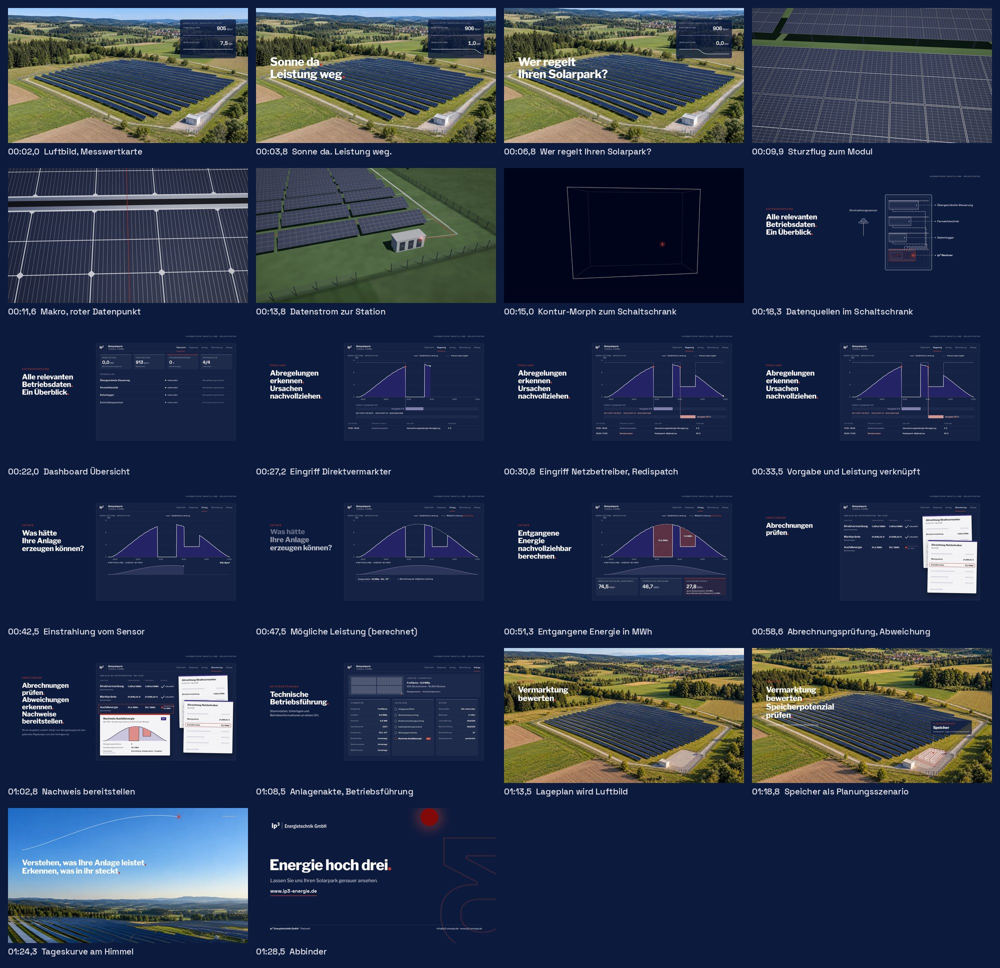

# ip³ Erklärvideo „Wer regelt Ihren Solarpark?“

Produktionsvorlage für ein 90-Sekunden-Werbe- und Erklärvideo der ip³ Energietechnik GmbH.
Hauptformat 16:9 (1920 × 1080, 30 fps), deutsch, Sie-Form, mit Untertiteln auch ohne Ton verständlich.

Zu dieser Vorlage gehört ein fertig gerenderter Film (`output/`). Er ist eine vollständige Fassung mit ElevenLabs-Stimme, KI-generierten Fotoplatten als Außenbildern und selbst erzeugter Layout-Musik. Bild, Timing, Texte und Untertitel sind final abstimmbar. Vor der Veröffentlichung sind die Musik zu ersetzen und die Nutzungsrechte von Stimme und Bildern zu prüfen (Abschnitt 6).

Inhalt

1. Kreatives Leitmotiv
2. Finaler Sprechertext
3. Storyboard
4. Produktionsanweisungen und Generierungsprompts
5. Noch benötigte Originalassets
6. Ton, Sprecher, Untertitel
7. Hinweise zur 9:16-Fassung
8. Annahmen und Beispieldaten

---

## 1. Kreatives Leitmotiv

**Der rote Punkt.** Ein einziger Punkt in Akzent-Rot führt durch den ganzen Film. Er leuchtet in der Zellstruktur eines Moduls auf, läuft als Datenstrom in den Schaltschrank, markiert im Dashboard jeden Eingriff und jede Abweichung, zieht am Ende die Tageskurve der möglichen Erzeugung über den Himmel und wird zum Sonnenpunkt des ip³-Zeichens.

Damit wird die Leitidee „Vom Solarpark in die Daten und aus den Daten zur wirtschaftlichen Entscheidung“ zu einer durchgehenden Kamerareise ohne harten Schnitt: Luftbild, Zellstruktur, Datenstrom, Schaltschrank, Dashboard, Lageplan, Luftbild, Himmel, Abbinder. Jede Übergangsbewegung hat einen Anker (Punkt, Kontur, Rahmen, Lageplan), sodass der Zuschauer nie den Faden verliert.

Der Punkt ist zugleich die Geste der Marke: Sonnenpunkt im Zeichen 3, roter Satzendpunkt in jeder Headline.

## 2. Finaler Sprechertext

180 Wörter, Sprechdauer der Layout-Stimme 67,7 s, Gesamtlänge 90 s. Pausen sind bewusst gesetzt, damit Bilder wirken. Zeitcodes = Einsatz im fertigen Film.

| Zeit | Szene | Text |
|---|---|---|
| 00:01,2 | 1 | Die Sonne scheint. |
| 00:02,5 | 1 | Trotzdem sinkt die Leistung. |
| 00:05,0 | 1 | Wer regelt Ihren Solarpark? |
| 00:06,8 | 1 | Und was kostet Sie das? |
| 00:08,9 | 1 | Die Antwort steckt in Ihren Betriebsdaten. |
| 00:11,7 | 2 | Wir installieren einen Rechner im Solarpark. |
| 00:14,6 | 2 | Er liest Steuerung, Fernwirktechnik, Datenlogger und Einstrahlungssensor aus. |
| 00:19,8 | 2 | Unsere Software bündelt alles in einem Dashboard. |
| 00:23,0 | 3 | So sehen Sie, wer eingreift. |
| 00:25,3 | 3 | Hier regelt der Direktvermarkter ab. |
| 00:28,6 | 3 | Dort der Netzbetreiber, im Rahmen von Redispatch. |
| 00:31,9 | 3 | Wir verknüpfen jede Vorgabe mit der tatsächlichen Leistung. |
| 00:35,4 | 3 | So wird die Ursache nachvollziehbar. |
| 00:38,1 | 4 | Doch was hätte Ihre Anlage erzeugen können? |
| 00:40,9 | 4 | Ein Sensor im Park misst, wie viel Sonne ankommt. |
| 00:44,4 | 4 | Mit den Anlagendaten berechnen wir die mögliche Leistung ohne Abregelung. |
| 00:49,1 | 4 | Die Fläche zwischen beiden Kurven ist die entgangene Energie. |
| 00:52,9 | 5 | Diese Werte gleichen wir mit Ihren Abrechnungen ab. |
| 00:55,5 | 5 | Direktvermarktung. Marktprämie. Ausfallenergie. |
| 00:59,4 | 5 | Abweichungen werden sichtbar. |
| 01:01,3 | 5 | Und Sie haben die Nachweise, um mögliche Ausgleichsansprüche zu prüfen. |
| 01:05,6 | 6 | Auf Wunsch übernehmen wir auch die technische Betriebsführung. |
| 01:09,5 | 6 | Und wir beraten Sie persönlich. |
| 01:11,6 | 6 | Passt Ihre Direktvermarktung zur Anlage? |
| 01:14,0 | 6 | Gibt es Verbesserungspotenzial? |
| 01:16,0 | 6 | Könnte sich ein zusätzlicher Speicher rechnen? |
| 01:18,6 | 6 | Das prüfen wir individuell. |
| 01:20,9 | 7 | Verstehen, was Ihre Anlage leistet. |
| 01:23,4 | 7 | Erkennen, was in ihr steckt. |
| 01:25,9 | 7 | Lassen Sie uns Ihren Solarpark genauer ansehen. |

Sprechanweisung: souverän, ruhig, direkt, nicht werblich. Etwa 125 bis 135 Wörter pro Minute, Fragen in Szene 1 und 6 ohne übertriebene Hebung, die Aufzählung „Direktvermarktung. Marktprämie. Ausfallenergie.“ mit kurzen Stopps im Takt der Einblendungen.
Aussprache: Redispatch [ˌreːdɪsˈpɛtʃ], Dashboard [ˈdɛʃbɔːɐ̯t], Marktprämie mit klarem „t“.

Formulierungen zu Ausgleich und Erstattung sind bewusst vorsichtig: „mögliche Ausgleichsansprüche prüfen“, „Abweichungen werden sichtbar“. Der Film verspricht keine Erstattung und behauptet nicht, dass jede Abregelung dem Direktvermarkter in Rechnung gestellt werden kann. Im Bild steht dazu die Fußnote „Ob ein Ausgleich zusteht, hängt vom Abregelungsgrund, den geltenden Regelungen und den Verträgen ab.“

## 3. Storyboard

Zeitcodes in mm:ss,z. Alle nachgebildeten Oberflächen tragen oben rechts „Schematische Darstellung · Beispieldaten“. Standbilder aus dem gerenderten Film liegen in `docs/storyboard/` (eine Datei je Einstellung).



| Zeit | Sprechertext | Bildhandlung | Einblendung | Übergang |
|---|---|---|---|---|
| 00:00,0–00:02,4 | (Musik, leises Messticken) „Die Sonne scheint.“ | Luftbild eines Freiflächenparks bei klarem Mittagslicht, Kamera in ca. 45 m Höhe, langsamer Vorwärtsflug über die Reihen Richtung Übergabestation (Südostecke). Messwertkarte oben rechts. | Messwertkarte „Beispieldaten · Beispieltag 11:30 Uhr“: Einstrahlung 913 W/m², Wirkleistung 7,5 MW | Aufblende aus Navy (0,8 s) |
| 00:02,5–00:04,8 | „Trotzdem sinkt die Leistung.“ | Wirkleistung fällt in zwei Sekunden auf 0,0 MW, Einstrahlung bleibt stehen. Roter Punkt im Verlauf markiert den Beginn des Abfalls. Keine Alarmfarben. | „Sonne da. Leistung weg.“ | Zeilenweise Maskeneinblendung |
| 00:05,0–00:08,7 | „Wer regelt Ihren Solarpark? Und was kostet Sie das?“ | Kamera sinkt weiter, Reihen und Schatten werden größer. | „Wer regelt Ihren Solarpark?“ | Textwechsel, Kamera läuft durch |
| 00:08,7–00:10,8 | „Die Antwort steckt in Ihren Betriebsdaten.“ | Ruhiger, logarithmischer Sturzflug von ca. 130 m bis 0,5 m über ein Modul. | – | Kamerafahrt ohne Schnitt |
| 00:10,8–00:12,4 | – | Makro über die Zellstruktur: Halbzellen, Busbars, Fasen, Mittelstreifen. Ein roter Punkt leuchtet auf einem Busbar auf und läuft zur Modulunterkante, die Kamera folgt. | – | Kamera folgt dem Punkt |
| 00:12,4–00:14,5 | „Wir installieren einen Rechner im Solarpark.“ | Kamera zieht auf. Der Punkt läuft als rote Linie am Boden zur Übergabestation, weiße Linien von Wechselrichtern und Einstrahlungssensor laufen dort zusammen. Station glüht innen rot. | – | Aufzug ohne Schnitt |
| 00:14,5–00:15,4 | „Er liest …“ | Anflug auf die Stationstür, Bild blendet nach Navy. Die Kontur der Station bleibt als Strichzeichnung stehen und morpht zum Schaltschrank, der rote Punkt landet im ip³ Rechner. | – | Kontur-Morph 3D zu Schema |
| 00:15,2–00:19,5 | „… Steuerung, Fernwirktechnik, Datenlogger und Einstrahlungssensor aus.“ | Schematischer Schaltschrank mit vier Hutschienen. Übergeordnete Steuerung, Fernwirktechnik, Datenlogger erscheinen synchron zur Nennung, Einstrahlungssensor außen mit Live-Wert. Datenleitungen mit laufenden Paketen zum ip³ Rechner. | Kicker „Datenerfassung“, Headline „Alle relevanten Betriebsdaten. Ein Überblick.“, Gerätebeschriftungen | – |
| 00:19,8–00:22,5 | „Unsere Software bündelt alles in einem Dashboard.“ | Pakete beschleunigen in den Rechner, sein roter Rahmen wächst zum Dashboard. Reiter „Übersicht“: Wirkleistung, Einstrahlung, Steuerungsvorgabe, Status der vier Datenquellen. | Dashboard „Beispielpark · Freifläche 9,8 MWp“ | Rahmen-Morph Rechner zu Dashboard |
| 00:22,5–00:27,5 | „So sehen Sie, wer eingreift. Hier regelt der Direktvermarkter ab.“ | Reiter „Regelung“: Tageskurve der Wirkleistung zeichnet sich bis 11:30. Steuerungsvorgabe (gestrichelt) springt auf 0 %, die Kurve fällt. In der Spur „Direktvermarkter“ wächst ein Balken, Verbindungslinie zum Kurvenpunkt. | Kicker „Regelung“, Headline „Abregelungen erkennen. Ursachen nachvollziehen.“, „Vorgabe 0 %“ | Reiterwechsel |
| 00:28,5–00:31,5 | „Dort der Netzbetreiber, im Rahmen von Redispatch.“ | 15:00 Uhr: Vorgabe 30 %, Spur „Netzbetreiber · Redispatch-Maßnahme“, Leistung wird gedeckelt. Ereignisprotokoll mit beiden Eingriffen. Redispatch erscheint nur als Prozess (Maßnahme), nie als Gerät. | „Vorgabe 30 %“, Protokollzeilen | – |
| 00:31,9–00:37,5 | „Wir verknüpfen jede Vorgabe mit der tatsächlichen Leistung. So wird die Ursache nachvollziehbar.“ | Vorgabelinie und Verbindungslinien heben sich hervor. Beide Ursachen bleiben farblich getrennt (Direktvermarkter Lavendel, Netzbetreiber Lachs). | – | – |
| 00:37,5–00:44,0 | „Doch was hätte Ihre Anlage erzeugen können? Ein Sensor im Park misst, wie viel Sonne ankommt.“ | Reiter „Ertrag“: Spuren weichen, der Einstrahlungsverlauf des Sensors zeichnet sich mit laufendem Wert in W/m². | Kicker „Ertrag“, Headline „Was hätte Ihre Anlage erzeugen können?“ | Reiterwechsel, Diagramm bleibt stehen |
| 00:44,0–00:48,3 | „Mit den Anlagendaten berechnen wir die mögliche Leistung ohne Abregelung.“ | Chip „Anlagendaten 9,8 MWp · Süd · 20°“, gestrichelte Kurve „Mögliche Leistung (berechnet)“ zeichnet sich über den ganzen Tag. | Legende „Mögliche Leistung (berechnet)“ | – |
| 00:48,0–00:52,5 | „Die Fläche zwischen beiden Kurven ist die entgangene Energie.“ | Flächen zwischen den Kurven füllen sich rot schraffiert (19,9 MWh und 7,9 MWh). Kennzahlen zählen hoch: mögliche Erzeugung 74,5 MWh, tatsächliche 46,7 MWh, entgangen 27,8 MWh mit Aufteilung nach Ursache. Leistung in MW, Energie in MWh. | Headline „Entgangene Energie nachvollziehbar berechnen.“ | – |
| 00:52,5–00:59,2 | „Diese Werte gleichen wir mit Ihren Abrechnungen ab: Direktvermarktung. Marktprämie. Ausfallenergie.“ | Reiter „Abrechnung“: stilisierte Abrechnungen von Direktvermarkter und Netzbetreiber (Mai 2026, Beispieldaten). Prüftabelle mit Abrechnungs- und Prüfwert, Zeilen erscheinen im Takt der Aufzählung, zwei Haken „plausibel“, Prüfmarker auf den Belegen. | Kicker „Abrechnung“, Zeilen „Direktvermarktung“, „Marktprämie“, „Ausfallenergie“, Headline „Abrechnungen prüfen.“ | Reiterwechsel |
| 00:59,4–01:05,0 | „Abweichungen werden sichtbar. Und Sie haben die Nachweise, um mögliche Ausgleichsansprüche zu prüfen.“ | Zeile Ausfallenergie rot umrandet: abgerechnet 31,2 MWh, berechnet 35,7 MWh, Abweichung 4,5 MWh. Nachweisdokument (PDF, Abregelungszeiträume und Mengen) erscheint und wandert verkleinert in die Unterlagen der Anlagenakte. Keine Rückzahlung, keine automatische Rechnung. | „Abweichungen erkennen. Nachweise bereitstellen.“, Fußnote zum Ausgleich | Beleg fliegt in die Anlagenakte |
| 01:05,0–01:10,5 | „Auf Wunsch übernehmen wir auch die technische Betriebsführung. Und wir beraten Sie persönlich.“ | Reiter „Anlage“: Lageplan, Stammdaten, Unterlagen (Nachweis als „neu“), Betrieb mit Betriebsführung ip³ und persönlichem Ansprechpartner. | Kicker „Betriebsführung“, „Technische Betriebsführung.“, „Stammdaten, Unterlagen und Betriebsinformationen an einem Ort.“, „Persönlich betreut durch ip³.“ | – |
| 01:10,4–01:15,8 | „Passt Ihre Direktvermarktung zur Anlage? Gibt es Verbesserungspotenzial?“ | Der Lageplan wächst auf Vollbild und geht deckungsgleich in den 3D-Draufblick über. Die Kamera kippt in ein Schrägluftbild bei warmem Nachmittagslicht. | Kicker „Beratung“, „Vermarktung bewerten.“ | Match-Cut Lageplan zu Luftbild |
| 01:16,0–01:20,0 | „Könnte sich ein zusätzlicher Speicher rechnen? Das prüfen wir individuell.“ | Neben der Station baut sich ein Batteriespeicher als transparentes Planungsszenario auf: weiße Kanten, kaum sichtbare Flächen, rot gestrichelte Aufstellfläche. | „Speicherpotenzial prüfen.“, Label „Planungsszenario · Speicher · schematisch, Lage und Größe beispielhaft“, „Individuelle Wirtschaftlichkeitsprüfung.“ | – |
| 01:20,0–01:25,0 | „Verstehen, was Ihre Anlage leistet. Erkennen, was in ihr steckt.“ | Kran nach oben, Blick über den Park zum Horizont. Eine weiße Linie zeichnet die Tageskurve der möglichen Erzeugung über den Himmel, an ihrer Spitze läuft der rote Punkt. | Abschlussbotschaft zweizeilig | – |
| 01:25,0–01:30,0 | „Lassen Sie uns Ihren Solarpark genauer ansehen.“ | Bild blendet nach Navy, der Punkt wird zum Sonnenpunkt des Zeichens 3 (Originaldatei, rechts angeschnitten). Wortmarke weiß, Claim, Handlungsaufforderung, Website mit rotem CTA-Strich, Kontaktzeile. | „Energie hoch drei.“, „Lassen Sie uns Ihren Solarpark genauer ansehen.“, „www.ip3-energie.de“ | Abblende nach Navy, Punkt als Bindeglied |

## 4. Produktionsanweisungen und Generierungsprompts

### 4.1 Grundregeln für alle Szenen

* **Format:** 1920 × 1080, 30 fps, Rec. 709. Master als ProRes 422 HQ, Web-Ausspielung H.264, 12 bis 16 Mbit/s.
* **Bildzonen:** Titelsicherer Rand 96 px links und rechts, untere 160 px frei für Untertitel. Textblock links (x 112 bis 660), Daten- und Bildinhalt rechts (x 704 bis 1824).
* **Farben:** Navy `#0C1A3D` als Grund, ip³ Blau `#2F2482` für Flächen (Fläche unter der Leistungskurve), Akzent-Rot `#C83C30` nur für Punkt, Satzendpunkt, Markierung und CTA, Hell `#E8E7EF` für Sekundärtext. Datenfarben aus der Diagramm-Serienfolge: Lavendel `#8D8AB8` (Direktvermarkter, Einstrahlung), Lachs `#E8A49C` (Netzbetreiber). Kein Ampelgrün, keine dekorativen Verläufe.
* **Typografie:** Headlines Libre Franklin ExtraBold, 58 bis 92 px, Laufweite −1,8 %, roter Satzendpunkt. Fließtext Libre Franklin Regular 23 px. Zahlen, Einheiten, Kicker und Beschriftungen Space Grotesk Medium/Bold mit Tabellenziffern, Kicker in Versalien mit 0,2 em Sperrung in Akzent-Rot. Geschütztes Leerzeichen vor jeder Einheit (913 W/m², 7,5 MW, 27,8 MWh).
* **Bewegung:** Texteinblendung zeilenweise aus einer Maske, 0,75 s je Zeile, 0,09 s Versatz, Kurve cubic-bezier(0.22, 1, 0.36, 1). Ausblendung 0,45 s. Kamerafahrten mit weichem Ein- und Auslauf, Distanzänderungen logarithmisch, keine Rucke, keine harten Schnitte.
* **Ebenen:** Schrift, Zahlen, Diagramme und Logos immer als eigene Grafikebenen. Nie Text in generierte Bilder rendern lassen.
* **Kennzeichnung:** nachgebildete Oberflächen „Schematische Darstellung“, erfundene Zahlen „Beispieldaten“, Speicher „Planungsszenario“.
* **Logo:** nur Originaldateien (Wortmarke weiß, Bildmarke weiß, Zeichen 3 Kontur). Nicht nachzeichnen, nicht verformen, nicht zerlegen.

### 4.2 3D-Welt (Szenen 1, 2, 6, 7)

Empfohlen ist eine echte 3D-Umsetzung (Blender, Cinema 4D oder Unreal), weil die durchgehende Kamerafahrt vom Luftbild bis in die Zelle mit generierten Videoclips nicht konsistent gelingt. Der mitgelieferte Film zeigt die Fahrt als fertige Referenz; die Engine in `engine/` enthält alle Maße.

* **Park:** 20 Reihen, je zwei Blöcke à 15 Tische, 600 Tische. Tisch 2P × 14 Module hochkant, Modul 2.278 × 1.134 mm, 144 Halbzellen, Neigung 20°, Unterkante 0,8 m, Reihenabstand 9,2 m, Mittelweg Nord-Süd 8 m, Querweg 6 m. Rammpfosten, Pfetten, verzinkter Stahl. String-Wechselrichter an den Reihenenden, Zaun 2 m, Übergabestation (Betonfertigteil 6,0 × 2,5 × 2,6 m) in der Südostecke, Pyranometer an der Oberkante des östlichsten Tisches.
* **Modulmaterial:** Zellen tiefes Navy-Schwarz, weiße Rückseitenfolie in den Fugen, 16 Busbars je Zelle, Fasen an den Zellecken, weißer Mittelstreifen mit Querverbindern, Rahmen eloxiertes Aluminium. Glas als Klarlack mit Rauheit 0,04, Umgebungsspiegelung gedämpft, damit die Module navyblau statt milchig wirken.
* **Licht:** Szenen 1 und 2 Sonnenstand 54° Elevation, Azimut 145° (Mittag, kräftige Schatten nach Nordwest). Szenen 6 und 7 Elevation 31°, Azimut 222° (warmer Nachmittag). Physikalischer Himmel mit sattem Zenitblau, leichter Dunst am Horizont, Luftperspektive ab ca. 1,5 km.
* **Landschaft:** Oberpfälzer Flur mit Feldern, Wiesen, Fichten- und Mischwaldkanten, sanfte Hügel. Gedeckte, leicht entsättigte Grüntöne (Sättigung ca. 80 %), damit Navy und Rot der Grafik tragen.
* **Datenstrom:** Linie in Akzent-Rot, 3 px Bildschirmbreite, Kopf als leuchtender Punkt. Nebenleitungen weiß 1,6 bis 2 px.
* **Speicher:** sechs 40-Fuß-Container und drei Mittelspannungsstationen auf rot gestrichelter Fläche, nur Kanten in Weiß, Flächen 14 % Deckkraft. Aufbau gestaffelt von unten nach oben.

### 4.3 Kameraplan

| Zeit | Einstellung | Objektiv | Bewegung |
|---|---|---|---|
| 00:00–00:07,6 | Luftbild Süd-Südost, Ziel Parkmitte bis Südostecke | 38–40° vertikal (ca. 32 mm KB) | Vorwärtsflug von 210 auf 130 m Abstand, Elevation 13° auf 18° |
| 00:07,6–00:10,8 | Sturzflug auf Modul 7 von Tisch Reihe 1, Ost | 40–44° | Abstand logarithmisch 130 m auf 0,5 m, Elevation auf 47° |
| 00:10,8–00:12,4 | Makro | 44° | 0,5 m über Glas, folgt dem Punkt entlang eines Busbars |
| 00:12,4–00:13,6 | Aufzug | 44° auf 40° | 0,44 m auf 48 m, Ziel bleibt bis 00:13,0 auf dem Datenpunkt, dann Schwenk Richtung Station |
| 00:13,6–00:15,0 | Anflug Station | 40° | auf 4,6 m vor die Tür, Elevation 9° |
| 01:10,6–01:11,4 | Draufblick | 30° | 640 m senkrecht, Norden oben, deckungsgleich mit Lageplan |
| 01:11,4–01:20,0 | Kippen ins Schrägluftbild | 30° auf 38° | Elevation 90° auf 23°, Ziel Speicherfläche |
| 01:20,0–01:25,2 | Kran nach oben zum Horizont | 38° auf 40° | Blick hebt sich bis 4° über die Horizontale |

### 4.4 Generierungsprompts für Bildplatten (optional)

Nur für Hintergrundplatten, Varianten oder Moodframes. Text, Zahlen, Diagramme und Logos werden nachträglich als Grafik gesetzt. Prompts auf Englisch, da die gängigen Bild- und Videomodelle damit am zuverlässigsten arbeiten.

**Szene 1, Luftbild**
```
Cinematic aerial drone shot of a large utility-scale ground-mounted solar park in rural Upper Palatinate, Bavaria, Germany, clear midday sun, deep blue sky with light haze on the horizon, 20 long east-west rows of south-facing dark navy monocrystalline PV modules on galvanized steel mounting tables, 20 degree tilt, crisp shadows on mown grass, gravel service roads, perimeter fence, small grey concrete transformer station in the south-east corner, spruce and mixed forest edges, gentle hills, calm slow forward dolly, photorealistic, natural colors slightly desaturated, 35mm lens, 16:9
Negative: text, letters, logos, watermarks, people, animals, cars, lens flare, oversaturated green, fisheye, tilt-shift, cartoon, CGI look, snow, clouds covering the sun
```

**Szene 1 bis 2, Makro Zellstruktur**
```
Extreme macro close-up gliding over the glass surface of a modern half-cut monocrystalline solar module, dark navy cells, sixteen thin silver busbar wires per cell, white backsheet gaps with small diamond-shaped corner chamfers, white center strip with flat ribbon connectors, soft daylight reflections on anti-reflective glass, shallow depth of field, slow steady camera movement, photorealistic, 16:9
Negative: text, logos, dirt, cracks, broken glass, rainbow artefacts, oversharpened, cartoon
```

**Szene 2, Station**
```
Ground-level view approaching a small light-grey prefabricated concrete transformer substation at the edge of a solar park, three dark grey steel doors with ventilation louvers, yellow high-voltage warning triangles, gravel pad, chain-link fence, midday sun, photorealistic, calm slow push-in, 16:9
Negative: text, readable signage, logos, people, graffiti, rust, cartoon
```

**Szene 6, Schrägluftbild mit Speicherfläche**
```
High oblique aerial view of a ground-mounted solar park in warm late-afternoon light, long soft shadows, next to the transformer station an empty rectangular gravel area reserved for a future battery storage system, surrounding Bavarian fields and forest, photorealistic, slow descending camera, 16:9
Negative: text, logos, containers, people, vehicles, oversaturated colors
```
Die Container des Planungsszenarios werden als Strichmodell in 3D ergänzt, nicht generiert, damit sie eindeutig als Planung lesbar bleiben.

**Szene 7, Schlussbild**
```
Wide aerial view over a solar park towards the horizon, camera rising and tilting up so the sky fills the upper two thirds of the frame, clear deep blue sky without clouds, soft haze over distant forested hills, calm and spacious, photorealistic, 16:9
Negative: text, logos, sun flare, birds, aircraft, people
```

**Videomodelle** (Runway, Veo, Kling oder vergleichbar): je Platte 5 bis 8 s, Kamerabewegung im Prompt mit „slow, steady, no shake“ beschreiben, Seed fixieren, Ergebnis auf 30 fps konformen. Für die Übergänge zwischen Platten gilt der Kameraplan aus 4.3.

### 4.5 Dashboard und Schemata (Szenen 2 bis 6)

* **Bevorzugt:** Bildschirmaufnahmen des echten ip³ Dashboards mit anonymisierten Daten, 60 fps, 2560 × 1440 oder höher, Mauszeiger ausgeblendet. Diese ersetzen die schematischen Ebenen 1:1 im Rahmen x 704, y 120, 1.120 × 780 px. Dann entfällt der Hinweis „Schematische Darstellung“ für diese Einstellungen.
* **Bis dahin:** die schematische Nachbildung aus dem Film verwenden (Navy-Panel, 1 px Linien mit 14 % Weiß, Reiter Übersicht, Regelung, Ertrag, Abrechnung, Anlage, aktiver Reiter mit rotem Unterstrich).
* **Diagrammregeln:** tatsächliche Leistung weiß 2,8 px mit ip³-Blau-Fläche, Steuerungsvorgabe Lavendel gestrichelt, mögliche Leistung weiß gestrichelt und als „(berechnet)“ beschriftet, entgangene Energie rot schraffiert. Achse Leistung in MW, Kennzahlen Energie in MWh.
* **Schaltschrank:** schematische Strichzeichnung mit vier Hutschienen. Gerätebeschriftungen exakt: „Übergeordnete Steuerung“, „Fernwirktechnik“, „Datenlogger“, „Einstrahlungssensor“, „ip³ Rechner“. Liegen Fotos des eingebauten Rechners vor, kann der Rechner als freigestelltes Foto auf der vierten Schiene erscheinen.

### 4.6 Abbinder (Szene 7)

Navy-Fläche. Zeichen 3 (Datei `zeichen-3-kontur-akzent.png`) mit 120 % Bildhöhe rechts angeschnitten, Kontur 20 % Deckkraft, Sonnenpunkt kräftiger (90 %). Wortmarke weiß oben links, Breite 470 px. „Energie hoch drei.“ 118 px ExtraBold mit rotem Punkt. Handlungsaufforderung 38 px Regular in Hell, Website 38 px Space Grotesk Bold mit rotem CTA-Strich. Unten feine Linie mit Kontaktzeile „ip³ Energietechnik GmbH · Theisseil“ und „info@ip3-energie.de · www.ip3-energie.de“. Standbild ab 01:27,5 bis zum Ende.

## 5. Noch benötigte Originalassets

1. **Bildschirmaufnahmen des echten Dashboards** (anonymisiert) für Übersicht, Regelung, Ertrag, Abrechnung und Anlagenakte, dazu die Freigabe, welche Funktionen und Bezeichnungen gezeigt werden dürfen.
2. **Produktname der Software**, falls es einen gibt. Der Film zeigt bisher nur die ip³-Bildmarke und „Beispielpark“.
3. **Fotos oder Video des installierten Rechners im Schaltschrank**, sonst bleibt die schematische Darstellung.
4. **Drohnenaufnahmen eines eigenen Freiflächenparks** mit schriftlicher Freigabe des Eigentümers, ohne erkennbare Namen oder Schilder (optional als Ersatz für die 3D-Luftbilder).
5. **Professionelle Sprachaufnahme** nach dem Text in Abschnitt 2, WAV 48 kHz / 24 bit, auf das Timing der Layout-Stimme geschnitten.
6. **Musiklizenz** für einen finalen Titel (96 BPM, ruhig, elektronisch, Auflösung zum Schluss) oder Freigabe der mitgelieferten Layout-Musik.
7. **Fachliche Freigabe** der Begriffe und Beispielwerte: „Vermarktungsbedingte Abregelung“, „Redispatch-Maßnahme“, „Ausfallenergie“, Monatswerte der Abrechnungsprüfung, Wortlaut der Fußnote zum Ausgleich.
8. **Optional:** Foto des Betriebsführungsteams oder eines Ansprechpartners für die Aussage „Persönlich betreut durch ip³“.
9. **Bestätigung der Logodateien:** verwendet wurden Wortmarke weiß (SVG), Bildmarke weiß (SVG) und Zeichen 3 Kontur Akzent (PNG) aus dem ip³-Markenpaket.

## 6. Ton, Sprecher, Untertitel

* **Stimme:** ElevenLabs, Alexander (Deep TV Narrator), Modell eleven_multilingual_v2, Tempo 0,95, satzweise erzeugt (audio/elevenlabs_saetze.mjs), auf Sprechanteil geschnitten und in engine/src/cues.json eingetaktet. Die Thorsten-Layoutstimme (CC0) liegt als Rückfallebene in audio/vo_layout/.
* **Fotoplatten:** Eröffnung (0 bis 9 s), Speicher-Szenario (71 bis 81 s) und Schlussbild (80 bis 85 s) nutzen KI-generierte Landschaftsbilder, gekennzeichnet als „Symbolbild“. Der Speicher wird als Strichmodell auf die Schotterfläche gezeichnet und ist als schematisch, Lage und Größe beispielhaft beschriftet.
* **Layout-Musik:** selbst synthetisiert, 96 BPM (ein Takt = 2,5 s, 36 Takte), d-Moll mit Auflösung nach F-Dur im Abbinder. Szenenwechsel liegen auf Taktgrenzen (10,0 / 22,5 / 37,5 / 52,5 / 65,0 / 80,0 s). Unter der Stimme wird die Musik um 8 dB abgesenkt.
* **Soundeffekte:** zurückhaltend, an Datenbewegungen gekoppelt (Punkt zündet 00:10,9, Ankunft Station 00:14,0, Geräte 00:15,2 bis 00:18,0, Eingriffe 00:25,4 und 00:28,7, Prüfhaken, Abweichung 00:58,4, Abbinder 01:25,0).
* **Pegel:** Mischung −16 LUFS integriert, True Peak unter −1 dBTP. Stems für Sprecher, Musik und Effekte liegen getrennt vor; ein Austausch der Stimme ist ohne neuen Bildschnitt möglich.
* **Untertitel:** SRT und WebVTT mit allen Sätzen (für YouTube und Website zuschaltbar). Die eingebrannte Fassung lässt die drei Schlusssätze weg, weil sie wörtlich im Bild stehen. Max. zwei Zeilen à 42 Zeichen, Libre Franklin SemiBold 40 px auf Navy-Fläche (75 %).

## 7. Hinweise zur 9:16-Fassung (1080 × 1920)

* Alle Texte, Zahlen und Diagramme liegen als getrennte Ebenen vor; die Hochkantfassung ist ein Neulayout, kein Beschnitt.
* **Aufbau je Bild:** Kicker und Headline oben (y 220 bis 560), Inhalt darunter (y 620 bis 1.500), Untertitel bei y 1.560 bis 1.680, darunter Freiraum für Plattform-Bedienelemente.
* **3D-Einstellungen:** gleiche Kamerapfade mit vertikalem Bildwinkel ca. 60°, Ziel leicht unter Bildmitte. Sturzflug und Makro funktionieren unverändert. Für das Schlussbild Horizont auf ca. 60 % der Bildhöhe, Kurve am Himmel steiler skalieren.
* **Dashboard:** statt eines breiten Panels je Szene ein Modul im Hochformat: Szene 3 nur Diagramm plus Spuren, Ereignisprotokoll entfällt; Szene 4 Diagramm oben, Kennzahlen gestapelt; Szene 5 Prüftabelle, Belege als Karte darunter; Szene 6 Karten nacheinander statt nebeneinander.
* **Schaltschrank:** Sensor über den Schrank setzen, Beschriftungen rechts verkürzt (Schriftgröße 26 px).
* **Abbinder:** Wortmarke oben, Claim mittig zweizeilig („Energie / hoch drei.“), Zeichen 3 rechts oben angeschnitten.
* **Länge:** Für Social Media zusätzlich eine 30-s-Schnittfassung aus Szene 1 (Hook), Szene 3 (Ursachen), Szene 4 (entgangene Energie) und Abbinder.

## 8. Annahmen und Beispieldaten

Alle Zahlen sind Beispieldaten und im Film so gekennzeichnet. Kein realer Kunde, keine reale Anlage.

| Größe | Wert |
|---|---|
| Beispielpark | Freifläche, 9,8 MWp, 600 Tische, 16.800 Module à 585 Wp, Süd, 20° |
| Anschlusswirkleistung | 8,5 MW (Bezug für Vorgaben in %) |
| Beispieltag | Mitte Mai, wolkenlos, Einstrahlung in Modulebene max. 985 W/m² |
| Eingriff 1 | Direktvermarkter, 11:30–14:00, Vorgabe 0 % |
| Eingriff 2 | Netzbetreiber, Redispatch-Maßnahme, 15:00–17:00, Vorgabe 30 % |
| Erzeugung | mögliche (berechnet) 74,5 MWh, tatsächliche 46,7 MWh, entgangen 27,8 MWh (19,9 MWh Direktvermarkter, 7,9 MWh Redispatch) |
| Abrechnung Mai 2026 | Direktvermarktung 1.284,6 MWh (plausibel), Marktprämie 21.838,20 € (plausibel), Ausfallenergie abgerechnet 31,2 MWh, berechnet 35,7 MWh, Abweichung 4,5 MWh |

Berechnungsansatz im Film (vereinfacht): mögliche Leistung = installierte Leistung × Einstrahlung in Modulebene / 1.000 W/m² × Performance-Faktor 0,84. Die reale Software rechnet mit den hinterlegten Anlagendaten; der Film zeigt nur das Prinzip.

Die Marktprämie erscheint in der Abrechnung des Netzbetreibers, der Vermarktungserlös in der Gutschrift des Direktvermarkters. Ob für eine Abregelung durch den Direktvermarkter ein Ausgleich zusteht, hängt vom Vertrag ab und wird im Film nicht behauptet.
